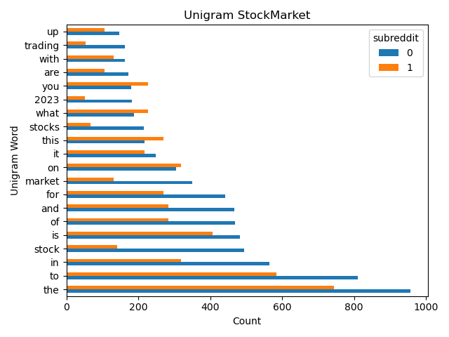
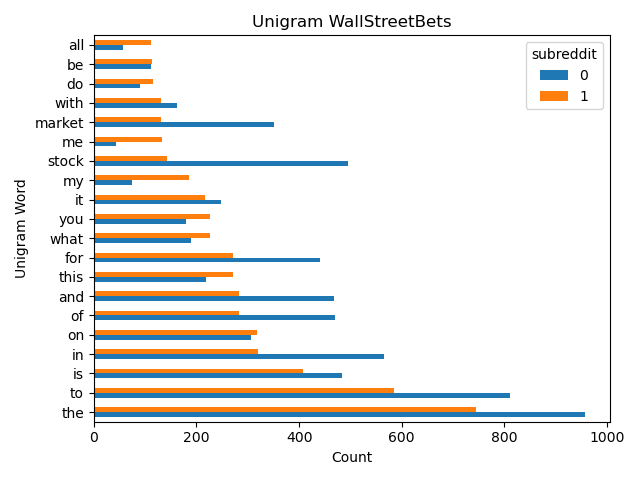
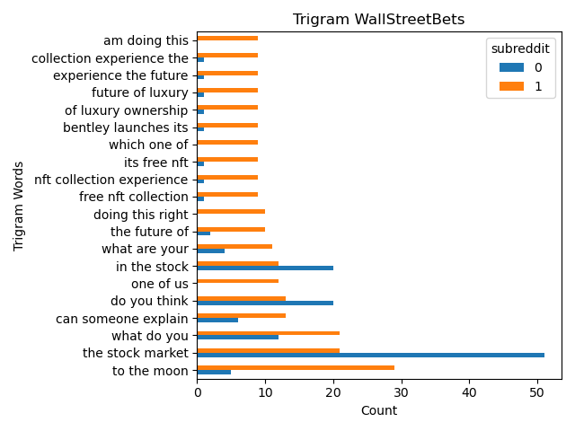
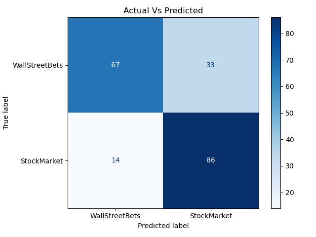

# Project 3 Web Apis & NLP

## Problem

 A coworker was tasked with gathering data of individual investors and current thoughts about the market. He gathered the data WallStreetBets and StockMarket. Our senior data scientist likes some of the content that was in it but he doesn’t think its smart to use data from wsb, however the worker didn’t label where the subreddits came from. 

## Problem Statement
Collect data from the two subreddits and create a model that can predict where the data came from and match it with the original data.

## Executive Summary
+ Collected data from Reddit Pushshift API
+ Explored through the dataset and mapped target value to binary
+ Broke down strings of text into n-grams with CountVectorizer 
+ Utilized Bagging, DecisionTrees, KNN, Linear Regression, and Boosting for models

## Datasets

[sm_data_test.csv](./csv_files/sm_data_test.csv)

[sm_data.csv](./csv_files/sm_data.csv)

[wsb_data_test.csv](./csv_files/wsb_data_test.csv)

[wsb_data.csv](./csv_files/wsb_data.csv)

## Data Dictionary
|Feature|Type|Dataset|Description|
|---|---|---|---|
|subreddit|int|sm_data_test.cv, sm_data, wsb_data_test_csv, wsb_data|Subreddit Page|
|title|str|sm_data_test.cv, sm_data, wsb_data_test_csv, wsb_data|Title of Subreddit Post|
|text|str|sm_data_test.cv, sm_data, wsb_data_test_csv, wsb_data|Body of SubReddit Post|

## Findings

With the above plots you can see theres a big difference in the text used within each subreddit. With that information we know that we can create a model that should be able to help classify our original data.

Our model wasn't perfect but it was able to correctly classify 70% of the "original" data.

## Conclusions
By utilizing ensemble models we can correctly predict more subreddits than if we were to guess on which one it came from.

To do:
+ Understand more of the API to pull in the data more cleanly.
+ Better optimize the hyperparameters
